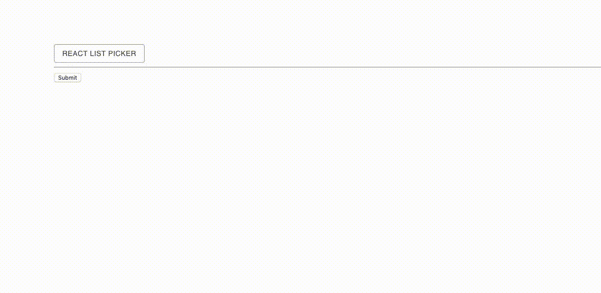

# react-list-picker

##### This project provides a List Picker Form field for [Material-UI][mui] and [React-Final-Form][rff]. The purpose is to have a compelling dymanic way for a user to select input in a form.



## Installation

### step 1:

```shell
npm i --save react-list-picker
```

### step 2:

## Installation (peer dependancies) - a must for it to work!

`npm i --save final-form react-final-form final-form-arrays react-final-form-arrays @material-ui/core`

**Note:** This is the version for Material-UI 1.0.0 or later.

## Usage

This is a simple example showing how `react-list-picker` integrates with `react-final-forms` and with `material-ui`.

```javascript
import React from "react";
import ListPickerField from "./ChipInput";
import { Form } from "react-final-form";
import { createMuiTheme, MuiThemeProvider } from "@material-ui/core/styles";
import arrayMutators from "final-form-arrays";

const myOptions = ["Meat Lover", "Veggie Heaven", "Hawaii-5-0", "Inferno"];

let output = [];

const onSubmit = values => {
  output = values.crazyList;
};

const theme = createMuiTheme({
  palette: {
    primary: { main: "#333" },
    secondary: { main: "#000" }
  },
  status: {
    danger: "orange"
  }
});

function App() {
  return (
    <MuiThemeProvider theme={theme}>
      <Form
        onSubmit={onSubmit}
        mutators={{
          ...arrayMutators // super important to include!!!
        }}
        render={({ handleSubmit, ...rest }) => (
          <form onSubmit={handleSubmit} style={{ padding: "50px" }}>
            <ListPickerField
              name="crazyList"
              data={myOptions}
              isMulty
              title="My crazy list"
              buttonText="React List Picker"
            />
            <hr />
            <button type="submit">Submit</button>

            {output.map(val => (
              <h6>{val}</h6>
            ))}
          </form>
        )}
      />
    </MuiThemeProvider>
  );
}

export default App;
```

## Properties

| Name         | Required                        | Type       | Default           | Description                             |
| ------------ | ------------------------------- | ---------- | ----------------- | --------------------------------------- |
| `name`       | ‏‏‎ ‏‏‎ ‏‏‎ ‏‏‎ ‏‏‎ ‏‏‎ ‏‏‎ yes | `string`   |                   | Field name for final form               |
| `data`       | ‏‏‎ ‏‏‎ ‏‏‎ ‏‏‎ ‏‏‎ ‏‏‎ ‏‏‎ yes | `string[]` |                   | The input to select from                |
| `isMulty`    | ‏‏‎ ‏‏‎ ‏‏‎ ‏‏‎ ‏‏‎ ‏‏‎ ‏‎ no   | `boolean`  | `false`           | Allow selecting multiple values         |
| `title`      | ‏‏‎ ‏‏‎ ‏‏‎ ‏‏‎ ‏‏‎ ‏‏‎ ‏‎ no   | `string`   | `"Select fields"` | Title shown on the ListPicker element   |
| `buttonText` | ‏‏‎ ‏‏‎ ‏‏‎ ‏‏‎ ‏‏‎ ‏‏‎ ‏‎ no   | `string`   | `"Select"`        | Text value of the submit changes button |

## License

The files included in this repository are licensed under the MIT license.

[rff]: https://github.com/final-form/react-final-form
[mui]: http://www.material-ui.com/#/
